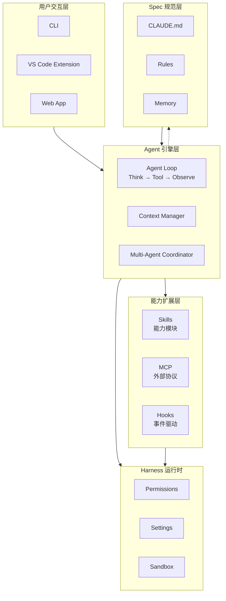
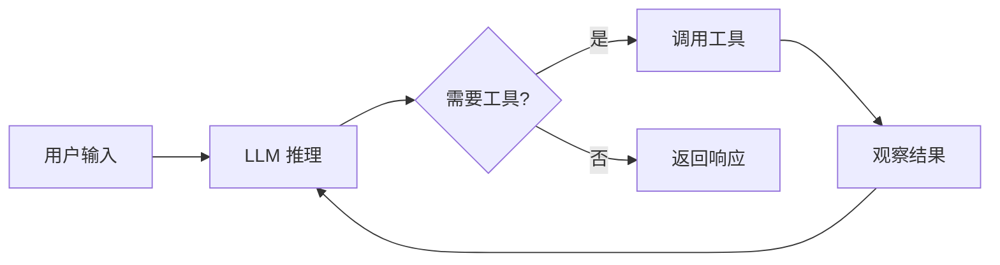
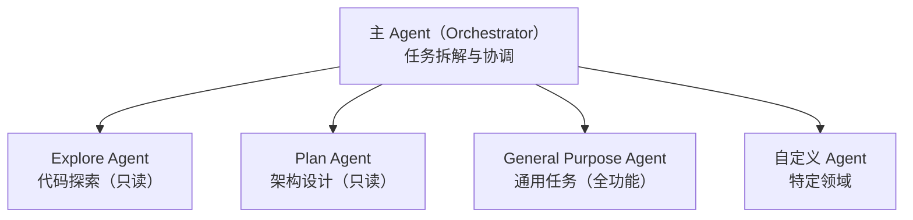
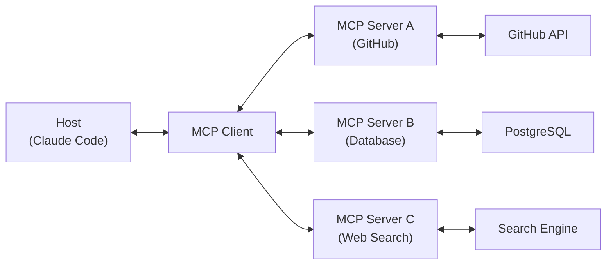
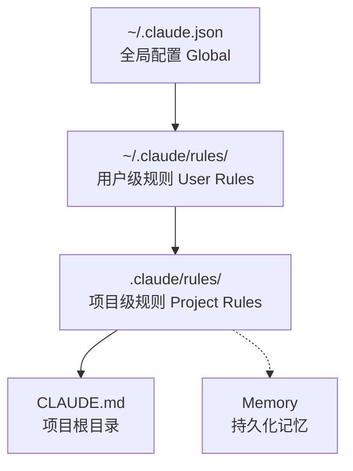

# 深入 Claude Code 工具链架构：从 Agent 到生态

## 目录

- [1. 引言 — AI 编程的工程化演进](#1-引言--ai-编程的工程化演进)
- [2. 全局架构 — Claude Code 的分层设计](#2-全局架构--claude-code-的分层设计)
  - [2.1 分层设计总览](#21-分层设计总览)
  - [2.2 全局架构图](#22-全局架构图)
  - [2.3 各层职责](#23-各层职责)
  - [2.4 设计哲学](#24-设计哲学)
- [3. Agent 引擎 — 核心决策循环](#3-agent-引擎--核心决策循环)
  - [3.1 Agent Loop：核心循环](#31-agent-loop核心循环)
  - [3.2 上下文管理](#32-上下文管理)
  - [3.3 多 Agent 协作](#33-多-agent-协作)
- [4. Skill 系统 — 可扩展的能力模块](#4-skill-系统--可扩展的能力模块)
  - [4.1 Skill 是什么](#41-skill-是什么)
  - [4.2 Skill 的文件结构](#42-skill-的文件结构)
  - [4.3 Skill 的发现与加载](#43-skill-的发现与加载)
  - [4.4 自定义 Skill 实战](#44-自定义-skill-实战)
- [5. MCP 协议 — 连接外部世界](#5-mcp-协议--连接外部世界)
  - [5.1 MCP 是什么](#51-mcp-是什么)
  - [5.2 MCP 架构](#52-mcp-架构)
  - [5.3 MCP 三大原语](#53-mcp-三大原语)
  - [5.4 MCP 配置实战](#54-mcp-配置实战)
  - [5.5 设计权衡](#55-设计权衡)
- [6. Hooks 机制 — 事件驱动的自动化](#6-hooks-机制--事件驱动的自动化)
  - [6.1 Hooks 是什么](#61-hooks-是什么)
  - [6.2 Hooks 的配置](#62-hooks-的配置)
  - [6.3 实战场景](#63-实战场景)
  - [6.4 Hooks vs MCP Tools](#64-hooks-vs-mcp-tools)
- [7. Spec 规范 — 声明式配置驱动 Agent 行为](#7-spec-规范--声明式配置驱动-agent-行为)
  - [7.1 Spec 是什么](#71-spec-是什么)
  - [7.2 Spec 的层次结构](#72-spec-的层次结构)
  - [7.3 CLAUDE.md 示例](#73-claudemd-示例)
  - [7.4 Spec 与 Agent 的关系](#74-spec-与-agent-的关系)
- [8. Harness 运行时 — 安全与配置基础设施](#8-harness-运行时--安全与配置基础设施)
  - [8.1 Harness 的角色定位](#81-harness-的角色定位)
  - [8.2 权限模型](#82-权限模型)
  - [8.3 配置层级](#83-配置层级)
  - [8.4 沙箱机制](#84-沙箱机制)
- [9. 生态包实战 — Superpowers 深度解析](#9-生态包实战--superpowers-深度解析)
  - [9.1 生态包概述](#91-生态包概述)
  - [9.2 Superpowers 深度解析](#92-superpowers-深度解析)
  - [9.3 其他热门包概览](#93-其他热门包概览)
  - [9.4 选型建议](#94-选型建议)
- [总结](#总结)

## 1. 引言 — AI 编程的工程化演进

AI 编程工具正在经历一次根本性的范式转变（Paradigm Shift）：从基于对话的 Chat 模式走向基于 Agent 的委托模式。ChatGPT、Cursor Chat 等工具代表了前一个时代——用户提问，AI 回答，用户根据回答手动执行操作。这是一种问答式的辅助：AI 是顾问，人是执行者。而 Claude Code、GitHub Copilot Workspace 等工具则标志着新阶段的到来——用户描述目标，AI 自主规划步骤、调用工具、执行多步骤任务并反馈结果。核心区别在于工具调用（Tool Use） 能力：Agent 能够读取和写入文件、执行 Shell 命令、搜索代码库、访问网络资源，甚至编排多个子 Agent 协同工作。这意味着开发者不再逐行逐句地与 AI 对话，而是将整个任务委托出去，AI 以「执行者」的身份完成端到端的工作流。从 Chat 到 Agent 的转变，本质上是从「AI 辅助人」到「人管理 AI」的模式升级。

在 Chat 时代，理解工具内部机制是可选的——你只需要会提问。但在 Agent 时代，这种理解变成了必修课。原因很直接：你正在配置一个拥有实际执行能力的 AI 系统。Claude Code 暴露了多个关键配置维度——通过 Skill 定义 AI 的能力边界，通过 Spec 约束 AI 的行为规则，通过 MCP 连接外部工具和数据源，通过 Hooks 构建事件驱动的自动化管线。如果不理解这些机制，会出现两种极端：要么 AI 缺乏足够的能力完成任务，反复向用户请求确认；要么 AI 拥有过多权限，带来安全风险和不可控行为。你现在做的不再是「向 AI 提问」，而是「配置一个 AI 团队」。理解架构，是这个时代开发者的基本功。

本文将从全局架构出发，自顶向下逐层剖析 Claude Code 的工具链设计。你将理解：Agent 引擎如何思考和决策，Skill 如何扩展 AI 的能力模块，MCP 如何桥接外部世界，Hooks 如何实现事件驱动的自动化，Spec 如何以声明式配置塑造 Agent 行为，Harness 如何提供安全的运行时基础设施，以及以 Superpowers 为代表的生态包如何将这些机制组合成可复用的工程方法论。每一层都解决一个特定问题，层层叠加构成了完整的 Agent 工程化体系。

## 2. 全局架构 — Claude Code 的分层设计

### 2.1 分层设计总览

Claude Code 的架构遵循经典的「关注点分离（Separation of Concerns）」原则，将系统拆分为五个职责清晰的层级。每一层只负责一件事：用户交互层处理输入输出，Agent 引擎层负责思考和决策，能力扩展层提供可插拔的工具模块，Harness 运行时保障安全与配置，Spec 规范层以声明式方式约束 Agent 行为。

这种分层设计（Layered Architecture）的核心价值在于：层与层之间通过定义良好的接口交互，而非实现细节的耦合。这意味着每一层可以独立演进，甚至在保持接口不变的前提下被整体替换。例如，用户交互层从 CLI 扩展到 VS Code Extension 再到 Web App，Agent 引擎层无需任何改动；Spec 规范层从 CLAUDE.md 演进到支持 Rules 和 Memory，能力扩展层对此无感知。这种松耦合使得系统在面对需求变化时具备高度的可维护性和可扩展性。

### 2.2 全局架构图

下图展示了 Claude Code 五层架构的完整视图，以及层间的依赖关系：



图中实线箭头表示直接依赖，虚线箭头表示 Spec 规范层通过注入 Prompt 间接影响 Agent 引擎的行为。值得注意的是，Spec 规范层不直接调用其他层的接口，而是通过声明式配置改变 Agent 的决策上下文——这是「声明式优于命令式」哲学的体现。

### 2.3 各层职责

| 层级 | 核心职责 | 关键组件 | 配置入口 |
|------|----------|----------|----------|
| 用户交互层 | 输入/输出 | CLI, VS Code, Web | — |
| Agent 引擎层 | 思考/决策/执行 | Agent Loop, Context Manager, Multi-Agent Coordinator | Agent 配置 |
| 能力扩展层 | 扩展 AI 能力 | Skills, MCP, Hooks | `.claude/skills/`, `mcp.json`, `settings.json` |
| Harness 运行时 | 安全/配置/沙箱 | Permissions, Settings, Sandbox | `settings.json` |
| Spec 规范层 | 行为约束 | CLAUDE.md, Rules, Memory | `CLAUDE.md`, `.claude/rules/` |

**用户交互层** 是开发者接触 Claude Code 的入口。无论是通过终端的 CLI、VS Code 中的 Extension 面板，还是浏览器中的 Web App，这一层的职责都是将用户的自然语言输入传递给 Agent 引擎，并将执行结果以可读的形式呈现给用户。交互形式不同，但底层共享同一套引擎。

**Agent 引擎层** 是整个系统的核心。Agent Loop 以「思考-调用工具-观察结果」的循环驱动任务执行；Context Manager 负责管理对话历史、Prompt 缓存和上下文窗口的裁剪策略；Multi-Agent Coordinator 处理多个 Agent 实例之间的任务分发、消息传递和结果汇总。

**能力扩展层** 是 Claude Code 区别于传统 Chat 工具的关键。Skills 封装了特定领域的知识和操作流程（如代码审查、TDD 工作流）；MCP 通过标准化协议连接外部工具和数据源；Hooks 在特定事件触发时执行自定义逻辑，构建事件驱动的自动化管线。三者可以自由组合，实现远超单个模块能力之和的效果。

**Harness 运行时** 提供了 Agent 运行所需的基础设施。Permissions 管理工具调用的权限审批策略，Settings 统一管理所有配置项，Sandbox 为文件操作和命令执行提供隔离的执行环境。这一层对上层透明，确保 Agent 在安全边界内运行。

**Spec 规范层** 以声明式的方式定义 Agent 应该怎么做，而非命令式地告诉它怎么做。CLAUDE.md 定义项目级的行为规范，Rules 将规范拆分为可复用的规则文件，Memory 则提供跨会话的知识持久化。三者共同注入到 Agent 的 Prompt 中，塑造其决策行为。

### 2.4 设计哲学

Claude Code 的架构围绕三条核心设计原则展开，这些原则贯穿每一层的实现：

**插件化（Pluggable）**——每一项能力都是一个可插拔的模块，而非硬编码在核心逻辑中。以 Skill 系统为例：代码审查、TDD 工作流、安全扫描等能力都封装为独立的 Skill 文件，存放在 `.claude/skills/` 目录下。开发者可以按需启用、禁用或替换任意 Skill，甚至编写自定义 Skill，而无需修改 Agent 引擎的代码。这种设计将「能力」与「引擎」解耦，使得系统的功能扩展不依赖核心代码的变更。

**可组合（Composable）**——独立的模块可以自由组合，产生 1+1>2 的效果。一个典型的例子是：当开发者配置了 TDD Skill + MCP（连接测试运行器）+ Hooks（在代码提交前自动触发测试），三者协同工作便形成了一条完整的自动化质量保障管线。每个模块只做好一件事，但组合在一起却解决了端到端的工程问题。可组合性使得系统在面对复杂场景时，不必为每个场景单独开发解决方案，而是通过模块的排列组合来应对。

**声明式优于命令式（Declarative over Imperative）**——Spec 规范层是这一原则的集中体现。开发者通过 CLAUDE.md 描述「代码应该是什么样的」（例如「所有函数必须有错误处理」「禁止硬编码密钥」），而不是编写脚本逐条检查。Agent 在每次决策时读取这些规范，将其内化为行为约束。这意味着规范的执行不需要额外的代码逻辑，Agent 本身就是规范的执行者。当规范需要调整时，只需修改声明式配置，无需改动任何实现代码。


## 3. Agent 引擎 — 核心决策循环

### 3.1 Agent Loop：核心循环

Agent 引擎的心脏是一个简洁但强大的循环：思考（Think）、行动（Act）、观察（Observe）。这个被称为 Agent Loop 的控制流是 Claude Code 所有能力的基石。用户发出一条指令后，引擎并非一次性生成最终答案，而是在多轮循环中逐步推进——每一轮都可能调用工具、读取文件、执行命令，直到任务完成。



一轮（Turn）的完整执行流程如下：

**1. 接收输入**——引擎收到两类输入之一：用户的新消息，或上一轮工具调用的返回结果。对于首轮交互，输入是用户的自然语言指令；对于后续轮次，输入是工具执行后的结构化结果（例如文件内容、命令输出、搜索匹配列表）。

**2. LLM 推理**——Claude 模型基于当前完整的上下文（System Prompt + 对话历史 + 工具结果）进行推理，分析当前状态，判断下一步应该做什么。这一步是纯粹的「思考」阶段，不产生任何副作用。

**3. 工具调用决策**——推理的结果有两种可能：如果当前信息不足以完成任务，模型生成一个工具调用请求（Tool Call），指定要调用的工具名称和参数（例如 `Read` 读取某个文件，`Grep` 搜索某个模式，`Bash` 执行某条命令）；如果推理已经得到最终答案，模型直接生成文本响应。

**4. 执行工具**——Harness 运行时层接收工具调用请求，执行权限检查后调用对应工具，并将结果以结构化格式返回。这一步发生在模型外部，由运行时基础设施负责。

**5. 观察结果**——工具执行结果被追加到对话历史中，作为新的一轮输入。模型在下一轮推理中可以分析这些结果，判断任务是否完成，或者是否需要进一步操作。如果需要，循环回到第 2 步。

**6. 终止条件**——循环在以下任一情况下终止：模型判定任务已完成并返回最终响应；对话的 Token 数接近上下文窗口（Context Window）上限；用户主动中断执行。

这个循环的设计哲学是「延迟决策」——模型不预先规划所有步骤，而是根据每一轮的实际观察结果动态调整下一步行动。这使得 Agent 能够应对意外情况：编译失败时自动排查错误，搜索结果为空时调整查询策略，文件结构与预期不符时重新分析。

### 3.2 上下文管理

Agent Loop 的每一步决策都依赖于上下文（Context）——模型在推理时能「看到」的全部信息。上下文管理（Context Management）是 Agent 引擎中最复杂的工程问题之一，直接影响决策质量和成本效率。

#### System Prompt 的组装

每次调用 LLM 时，引擎会动态组装 System Prompt，其构成如下：

```
System Prompt = 基础指令 (Base Instructions)
              + Skills（匹配到的 Skill 内容）
              + Rules（.claude/rules/ 下的规则）
              + CLAUDE.md（项目规范）
              + Memory（持久化记忆）
              + MCP Tools 描述（可用工具列表）
```

基础指令包含了 Agent 的身份定义、行为准则和工具使用规范。Skill、Rules、CLAUDE.md 和 Memory 则是项目特定的行为约束，它们以自然语言的形式注入到 Prompt 中，让模型「理解」当前项目的规范和偏好。MCP Tools 描述列出了所有可用的外部工具及其参数 Schema，使模型知道有哪些工具可以调用以及如何调用。

值得注意的是，这些组件并非静态拼接。引擎会根据当前激活的 Skill、匹配到的 Rule 文件以及项目的 Memory 内容，动态决定注入哪些内容。这意味着不同的项目、不同的任务场景，模型看到的 System Prompt 是不同的。

#### 消息压缩（Compaction）

上下文窗口（Context Window）是有限的资源。当对话历史接近窗口上限时，引擎会自动触发消息压缩（Compaction）：较早的对话轮次被压缩为摘要，保留关键信息但大幅减少 Token 占用。这种机制确保 Agent 能够在长时间的任务中持续工作，而不会因为上下文溢出而丢失关键信息。

压缩策略采用滑动窗口（Sliding Window）模式：最近的 N 轮对话保持完整，更早的轮次只保留摘要。窗口大小根据模型的上下文窗口动态调整。开发者在压缩后的上下文中仍然可以追溯到关键决策和工具调用结果，但具体细节被浓缩为语义摘要。

#### Prompt Caching

System Prompt 中的许多组件在不同轮次间保持稳定——基础指令、CLAUDE.md、Rules、MCP Tools 描述通常不会在会话中发生变化。引擎利用 Prompt Caching 机制，将这些稳定部分缓存起来，避免在每一轮调用中重复传输和计算。这不仅降低了延迟，还显著减少了 Token 消耗成本。缓存命中时，对应的 Token 按折扣计费，使得长会话的边际成本可控。

### 3.3 多 Agent 协作

单个 Agent 在处理复杂任务时可能遇到瓶颈：任务涉及多个独立子任务需要并行执行，或者某些子任务需要特定的专业能力。Claude Code 通过多 Agent 协作（Multi-Agent Coordination）机制解决这一问题。

#### Agent 类型系统

Claude Code 定义了几种内置的 Agent 类型，每种类型拥有不同的能力边界：



**Explore Agent** 是只读的代码探索专家。它只能使用 Read、Grep、Glob 等读取类工具，无法修改任何文件。这种权限限制确保了它在大规模代码库搜索中不会产生副作用。当主 Agent 需要了解代码结构、查找某个函数的定义或分析依赖关系时，派遣 Explore Agent 是最高效的选择。

**Plan Agent** 同样是只读的，专注于架构设计和实施规划。它能够阅读代码、搜索文件，但不能执行写操作。Plan Agent 的价值在于将「思考」与「执行」分离——先由 Plan Agent 制定详细的实施计划，再由具备写权限的 Agent 按计划执行。这种分工减少了执行过程中的方向性错误。

**General Purpose Agent** 拥有完整的工具访问权限——可以读写文件、执行命令、安装依赖、运行测试。它适用于需要实际编码和操作的任务。主 Agent 通常将实施类子任务派遣给这类 Agent。

**自定义 Agent** 通过 `.claude/agents/` 目录下的配置文件定义，针对特定领域定制。例如，可以定义一个专门处理安全审查的 Agent，预置安全检查的知识和流程；或者定义一个专注于数据库迁移的 Agent，内置迁移脚本的最佳实践。自定义 Agent 继承某个基础类型的工具集，并叠加领域特定的 System Prompt 指令。

#### 并行调度与结果汇总

主 Agent（Orchestrator）负责任务拆解和子 Agent 的调度。当识别到多个相互独立的子任务时，主 Agent 可以通过 `Agent` 工具同时派遣多个子 Agent 并行执行。每个子 Agent 拥有独立的上下文空间，互不干扰。这种并行模式显著缩短了复杂任务的完成时间——例如，同时派遣三个 Agent 分别进行安全审查、代码质量检查和性能分析，而非串行执行。

子 Agent 完成任务后，结果通过工具返回值（Tool Return Value）传回主 Agent。主 Agent 将各子 Agent 的结果汇总，综合判断任务是否完成，或是否需要进一步操作。对于需要跨 Agent 协调的场景，主 Agent 可以通过 `SendMessage` 工具向特定子 Agent 发送消息，传递补充信息或调整任务方向。

这种多 Agent 架构的核心优势在于**关注点分离**：每个 Agent 专注于一个明确的子任务，拥有恰好足够的权限，不受无关信息干扰。主 Agent 则扮演「项目经理」的角色，统筹全局，确保各子任务的结果能够正确地组合为整体解决方案。


## 4. Skill 系统 — 可扩展的能力模块

### 4.1 Skill 是什么

Skill（技能）是 Claude Code 能力扩展层的核心机制。它的定义出人意料地简洁：一个 Skill 是一份**结构化的 Markdown 指令文档**，教会 Agent「如何完成某类任务」。与传统的代码插件（Plugin）不同，Skill 不是可执行代码，而是行为指导——它的执行者不是运行时引擎，而是 LLM 自身。

这种设计体现了一次深刻的范式转变：你编写的不再是「做事情的代码」，而是「教会 AI 做事情的指令」。AI 本身就是运行时（Runtime）。这意味着扩展系统能力的方式，从编写函数、编译模块，变成了撰写清晰的方法论文档。开发者的角色从「程序员」转向了「AI 教练」。

传统插件与 Skill 的核心差异可以通过下表直观理解：

| 特性 | 传统插件（Traditional Plugin） | Skill |
|------|-------------------------------|-------|
| 本质 | 可执行代码 | 结构化文本指令 |
| 执行者 | 运行时引擎（Runtime Engine） | LLM 自身 |
| 扩展方式 | 添加函数/模块 | 教会 AI 新的方法论 |
| 失败模式 | 抛出异常（Exception） | AI 可能忽略或偏离指令 |
| 调试方式 | 断点/日志（Breakpoint/Log） | 检查 AI 是否遵循指令 |
| 开发门槛 | 需要掌握特定语言和 API | 只需要清晰的文字表达 |

这个差异带来了一个关键 trade-off：Skill 的编写门槛极低（任何能用自然语言描述流程的人都可以编写），但它的执行可靠性取决于 LLM 是否忠实地遵循指令。这催生了 Skill 工程中一类独特的技术——「反合理化（Anti-Rationalization）」机制，即在指令中预判 AI 可能找借口跳过规则的场景，并提前封堵。例如 Superpowers 的 `verification-before-completion` Skill 列出了 AI 常见的自我辩解话术（"应该没问题"、"看起来正确"），并逐一给出反驳理由。

### 4.2 Skill 的文件结构

每个 Skill 由两个部分组成：Frontmatter（前置元数据）和 Body（指令正文）。以 Superpowers 插件中真实的 `brainstorming` Skill 为例：

```markdown
---
name: brainstorming
description: "You MUST use this before any creative work - creating features,
  building components, adding functionality, or modifying behavior.
  Explores user intent, requirements and design before implementation."
---

# Brainstorming Ideas Into Designs

Help turn ideas into fully formed designs and specs through
natural collaborative dialogue.

<HARD-GATE>
Do NOT invoke any implementation skill, write any code,
scaffold any project, or take any implementation action
until you have presented a design and the user has approved it.
</HARD-GATE>

## Checklist

You MUST create a task for each of these items:

1. **Explore project context** — check files, docs, recent commits
2. **Ask clarifying questions** — one at a time
3. **Propose 2-3 approaches** — with trade-offs
4. **Present design** — get user approval
5. **Write design doc** — save to docs/superpowers/specs/

## Process Flow

digraph brainstorming {
    "Explore context" -> "Ask questions" -> "Propose approaches"
    -> "Present design" -> "User approves?" -> "Write spec"
}
```

**Frontmatter 字段说明：**

- `name`：Skill 的唯一标识符，同时决定斜杠命令的调用形式（例如 `name: brainstorming` 对应 `/brainstorming`）。命名规范限制为字母、数字和连字符。
- `description`：触发描述——Agent 读取这段文本来判断何时应该使用该 Skill。写法上有一个关键约束：只描述**何时触发**，不描述**做了什么**。原因是测试表明，当 description 概括了 Skill 的工作流程时，LLM 可能直接按 description 的摘要行动，而跳过阅读完整的 Skill 内容。

**Body 中的特殊指令标签：**

- `<HARD-GATE>`：强制门控——必须满足前置条件后才能继续执行。例如 brainstorming Skill 中的「在用户批准设计之前不得编写任何代码」。
- `<SUBAGENT-STOP>`：子 Agent 跳过标记——当当前 Agent 是被派发执行特定任务的子 Agent 时，跳过此 Skill。这防止了嵌套 Skill 调用导致的上下文浪费。
- `<EXTREMELY-IMPORTANT>`：关键行为规则——标记不可妥协的强制性指令。例如 using-superpowers Skill 中标注的「只要有 1% 的可能性某个 Skill 适用，你就必须调用它」。

**Body 的常见结构模式：**

Skill 的正文通常包含以下几种结构化元素。Checklist（检查清单）是最常见的模式，用编号列表定义必须完成的步骤，Agent 会为每个条目创建对应的任务。Process Flow（流程图）使用 DOT 语言描述决策分支和循环逻辑，适合表达非线性工作流。Decision Table（决策表）以表格形式列出常见借口与反驳理由，用于封堵 Agent 的合理化倾向。这三类结构并非互斥，一个 Skill 可以自由组合使用。

### 4.3 Skill 的发现与加载

Claude Code 的 Skill 来自三个不同的来源：

1. **内置 Skill（Built-in）**：随 Claude Code 一起发布的 Skill，如 `/init`（初始化项目配置）和 `/review`（代码审查）。它们硬编码在工具内部，用户无法修改。
2. **项目 Skill（Project Skill）**：存放在项目目录 `.claude/skills/` 下的 Skill，针对特定项目的定制化流程。团队成员共享同一份 Skill 定义，确保协作一致性。
3. **插件 Skill（Plugin Skill）**：通过插件系统安装的 Skill。以 Superpowers 插件为例，它提供了 13 个覆盖完整开发生命周期的方法论 Skill，从 brainstorming（需求探索）到 verification-before-completion（完成前验证）。

Skill 的文件系统扫描路径按优先级排列如下：

- `.claude/skills/` — 项目级，优先级最高，适合放置团队共享的项目特定流程
- `~/.claude/skills/` — 用户级，跨项目生效，适合放置个人通用方法论
- `~/.claude/plugins/cache/` — 插件缓存目录，由插件系统自动管理

Skill 的加载采用**相关性匹配（Relevance Matching）**机制，而非全量加载。其流程如下：

```
对话启动
  → 扫描所有 Skill 的 description 字段，构建可用 Skill 索引
  → 将索引摘要注入 System Prompt
  → Agent 收到用户消息后，评估是否有相关 Skill
  → 匹配到相关 Skill → 通过 Skill Tool 加载完整内容
  → 未匹配 → 使用默认行为响应
```

这个设计的关键在于：System Prompt 中只包含所有 Skill 的 description 摘要（而非完整内容），只有当 Agent 判断某个 Skill 与当前任务相关时，才会加载完整指令。这是一种按需加载（Lazy Loading）策略，在上下文窗口（Context Window）资源有限的前提下，尽可能减少不必要的内容注入。同时，这也解释了为什么 description 的撰写质量至关重要——它是 Skill 被「发现」的唯一入口。

### 4.4 自定义 Skill 实战

理解了 Skill 的原理后，来看一个完整的自定义 Skill 示例。假设你的团队需要一套统一的 REST API 设计规范，可以编写如下 Skill：

```markdown
---
name: api-design
description: "Use when designing REST API endpoints —
  ensures consistent naming, error handling, and documentation patterns."
---

# API Design Skill

## Rules

1. Use plural nouns for resource names (`/users`, not `/user`)
2. Return consistent envelope format
3. Validate all inputs with schema
4. Use standard HTTP status codes
5. Version all endpoints (`/v1/users`)

## Response Envelope

All endpoints must return:

{
  "success": true,
  "data": {},
  "error": null,
  "meta": { "page": 1, "limit": 20, "total": 100 }
}

## Checklist

- [ ] Resource names follow plural convention
- [ ] Response envelope is consistent
- [ ] Input validation is defined
- [ ] Error codes follow HTTP standard
- [ ] Endpoint versioning is applied

## Common Mistakes

| Mistake | Correction |
|---------|------------|
| Using verbs in URLs | Use nouns: `POST /users` not `POST /createUser` |
| Returning raw errors | Wrap in envelope with `success: false` |
| Missing pagination | Add `meta` field for list endpoints |
| No input validation | Define schema for every request body |
```

将此文件保存为 `.claude/skills/api-design/SKILL.md`，Claude Code 在下次对话启动时即可自动发现。此后，每当开发者提出「帮我设计一个用户管理接口」或「添加一个新的 API 端点」之类的请求时，Agent 就会自动加载并遵循这套 API 设计规范——确保资源命名、响应格式、输入验证和版本控制的一致性。

这个例子揭示了 Skill 系统的真正价值：它将团队的工程规范从「文档中被动等待查阅的规则」转变为「Agent 主动遵循的行为约束」。规范不再是写在 Wiki 里的建议，而是每次相关任务执行时都会被自动加载和强制执行的指令。这是从「人去遵守规范」到「AI 替你遵守规范」的质变。

## 5. MCP 协议 — 连接外部世界

### 5.1 MCP 是什么

模型上下文协议（Model Context Protocol, MCP）是一个开放标准协议，定义了 AI 应用与外部工具和数据源之间的通信规范。它解决的核心问题是碎片化集成：在没有统一协议的情况下，每个 AI 应用要接入 GitHub，就需要编写一套 GitHub 专用的集成代码；要接入数据库，又要编写一套数据库专用的集成代码。N 个应用接入 M 个服务，复杂度是 N x M。MCP 将这个问题简化为 N + M——每个应用实现一次 MCP Client，每个服务实现一次 MCP Server，双方通过标准协议通信即可互联。

一个恰当的类比是 USB 协议。在 USB 出现之前，键盘用 PS/2 接口，打印机用并口，调制解调器用串口，每种外设都有专属的连接方式和驱动程序。USB 统一了这些接口——任何 USB 设备都可以插入任何 USB 端口。MCP 在 AI 领域扮演了类似角色：任何 MCP Server 都可以被任何兼容 MCP 的 AI 应用直接使用，无需为每个应用单独编写集成逻辑。

### 5.2 MCP 架构

MCP 采用经典的 Client-Server 架构，在 AI 应用内部署了一个协议客户端，通过标准化协议与外部服务通信：



架构中存在三个角色：

**Host（宿主）** 是 AI 应用本身，即 Claude Code。Host 内部嵌入一个或多个 MCP Client 实例，负责管理与各 MCP Server 的连接生命周期。Host 不直接与 MCP Server 通信，而是通过 Client 中转。

**Client（客户端）** 是协议客户端，运行在 Host 进程内部。每个 Client 实例管理与一个 MCP Server 的连接，负责协议握手、能力协商（Capability Negotiation）、消息序列化和传输层通信。Client 将 Server 暴露的工具和数据转换为 LLM 可理解的工具描述（Tool Description），注入到 Agent 的上下文中。

**Server（服务端）** 是独立进程，封装了对特定外部服务的访问逻辑。一个 GitHub MCP Server 封装了 GitHub API 的调用，一个数据库 MCP Server 封装了 SQL 查询的执行。Server 作为独立进程运行，与 Host 进程隔离，这种进程级隔离是 MCP 安全模型的基础。

### 5.3 MCP 三大原语

MCP 定义了三种核心原语（Primitive），分别对应 AI 与外部世界交互的三种模式：

| 原语 Primitive | 类比 | 说明 | 示例 |
|------|------|------|------|
| Tools | 函数调用 | AI 可调用的操作，产生副作用 | `search_code`, `create_issue`, `query_database` |
| Resources | 文件/数据 | AI 可读取的数据源，只读访问 | 代码仓库、数据库 Schema、API 文档 |
| Prompts | 模板 | 预定义的 Prompt 模板，标准化交互模式 | 代码审查模板、Commit Message 模板 |

**Tools（工具）** 是最常用的原语。每个 Tool 定义了名称、描述、参数 Schema 和执行逻辑。当 Agent 判断需要调用某个外部操作时，它生成一个结构化的工具调用请求，MCP Client 将请求转发给对应的 MCP Server 执行，并将结果返回给 Agent。例如，GitHub MCP Server 暴露的 `create_issue` Tool 接受标题、正文、标签等参数，Agent 调用它即可在仓库中创建 Issue——Agent 无需了解 GitHub API 的认证方式、请求格式和错误码映射。

**Resources（资源）** 提供只读的数据访问接口。与 Tools 的区别在于，Resources 不产生副作用——它只让 AI「看到」外部数据，而不能修改。典型的 Resources 包括：数据库的 Schema 定义（让 AI 理解表结构以生成正确的查询）、项目的 API 文档（让 AI 了解接口规范以生成兼容的调用代码）、运行时配置文件（让 AI 感知当前环境设置）。Resources 通过 URI 标识，Agent 可以按需读取。

**Prompts（提示模板）** 是预定义的交互模板，用于标准化常见的 AI 工作流。例如一个 `code-review` Prompt 模板可以预置代码审查的检查维度、输出格式和质量标准。当开发者需要审查代码时，Agent 加载此模板，按照预设的结构化流程执行审查，确保每次审查的覆盖范围和深度一致。Prompts 将团队的「最佳实践」固化为可复用的模板。

### 5.4 MCP 配置实战

MCP 的配置以声明式的 JSON 格式编写，告诉 Claude Code 如何启动和连接各个 MCP Server。配置文件存放于两个位置：`~/.claude/mcp.json` 为全局配置，对所有项目生效；`.claude/mcp.json` 为项目级配置，仅对当前项目生效。项目级配置会与全局配置合并。

一个典型的配置文件如下：

```json
{
  "mcpServers": {
    "github": {
      "command": "npx",
      "args": ["-y", "@modelcontextprotocol/server-github"],
      "env": {
        "GITHUB_PERSONAL_ACCESS_TOKEN": "ghp_your_token_here"
      }
    },
    "filesystem": {
      "command": "npx",
      "args": [
        "-y",
        "@modelcontextprotocol/server-filesystem",
        "/path/to/allowed/directory"
      ]
    },
    "web-search": {
      "command": "npx",
      "args": ["-y", "exa-mcp-server"],
      "env": {
        "EXA_API_KEY": "your_api_key_here"
      }
    }
  }
}
```

**关键字段解析：**

- `command`：启动 MCP Server 进程的 Shell 命令。大多数 MCP Server 是 Node.js 包，因此通常使用 `npx` 直接运行。也可以是 `python`、`docker` 或任何可执行文件。
- `args`：传递给启动命令的参数数组。`-y` 标志用于自动确认 npx 的安装提示，后续参数指定包名和配置。
- `env`：注入到 MCP Server 进程的环境变量。API 密钥、连接字符串等敏感信息通过环境变量传递，而非硬编码在对话上下文中——这是 MCP 安全模型的关键设计。
- 传输层（Transport）：MCP 支持两种传输方式。stdio（标准输入输出）是最常用的模式，Client 和 Server 通过进程的标准输入输出流通信，适用于本地部署；SSE（Server-Sent Events）基于 HTTP 长连接，适用于远程部署场景。配置中未显式指定传输层时，默认使用 stdio。

配置生效后，Claude Code 在启动时会自动启动所有配置的 MCP Server 进程，获取它们暴露的 Tools、Resources 和 Prompts 列表，并将工具描述注入到 Agent 的 System Prompt 中。此后，Agent 就像使用内置工具一样调用这些外部能力——对 Agent 而言，MCP Tools 与 Read、Write、Bash 等内置工具在调用方式上没有区别。

### 5.5 设计权衡

**MCP vs 直接 API 调用**

为什么不让 Agent 直接调用 GitHub API 或数据库 SDK，而是引入一层协议抽象？这个问题的答案取决于你在哪个维度上做评估。

MCP 的优势在于标准化和复用。一个 MCP Server 编写一次，所有兼容 MCP 的 AI 应用都可以直接使用——不管是 Claude Code、Cursor 还是其他工具。工具描述通过协议自动发现，Agent 无需硬编码「这个工具怎么用」的知识。权限隔离通过进程边界实现，API 密钥通过环境变量管理，不进入对话上下文。错误处理也是标准化的——所有 MCP Server 返回统一的错误格式。

这些优势的代价是额外的进程开销和协议层。每个 MCP Server 是一个独立进程，占用系统资源；协议层的抽象意味着调用链比直接 API 调用更长。此外，开发者需要学习 MCP 的配置方式和协议规范。

实践中，选择标准很明确：当 AI 需要访问外部服务（GitHub、数据库、搜索引擎、消息队列等）时，始终优先使用 MCP。当操作仅涉及本地文件系统、代码搜索或 Shell 命令时，Claude Code 的内置工具（Read、Write、Bash、Grep、Glob）已经足够，无需引入 MCP 的额外开销。

**安全模型**

MCP 的安全架构基于进程隔离原则。每个 MCP Server 作为独立进程运行，与 Host 进程之间通过 stdio 或 HTTP 通信——Server 无法直接访问 Host 的内存空间或文件描述符。这种隔离确保了一个恶意的或有缺陷的 Server 不会影响 Host 的稳定性。

敏感凭证的管理遵循最佳实践：API 密钥通过环境变量注入到 Server 进程，而非出现在对话上下文或日志中。这意味着用户在与 Agent 的对话中不会看到任何密钥明文，Agent 在推理过程中也不会接触到这些凭证——它只需要知道「我可以调用 `create_issue`，传入标题和正文」，认证细节由 Server 内部处理。

工具描述的自动发现机制也是安全设计的一部分。Server 向 Client 注册工具时，会提供每个工具的 JSON Schema 描述，包括参数类型、必填字段和用法说明。Agent 通过阅读这些描述来决定何时以及如何调用工具，而非依赖硬编码的工具知识。这意味着工具的变更（新增参数、废弃旧接口）可以通过更新 Server 的描述自动传播给 Agent，无需修改 Agent 的任何代码。

## 6. Hooks 机制 — 事件驱动的自动化

### 6.1 Hooks 是什么

Hooks 是事件驱动的 Shell 命令，在 Agent 工具调用的特定阶段自动触发。它们不改变 Agent 的推理过程，而是在执行层（Harness）插入自定义逻辑。如果把 Agent Loop 比作一条高速公路，Hooks 就是设在关键节点的收费站和检查站——车辆（工具调用）照常通行，但在通过特定位置时会自动执行额外操作。

Claude Code 目前支持以下事件类型：

| 事件 | 触发时机 | 典型用途 |
|------|----------|----------|
| `PreToolUse` | 工具执行前 | 安全检查、参数校验、权限控制 |
| `PostToolUse` | 工具执行后 | 自动格式化、日志记录、审计追踪 |
| `SessionStart` | 对话启动时 | 环境初始化、上下文注入 |
| `Stop` | Agent 响应结束时 | 最终验证、状态检查 |
| `PreCompact` | 上下文压缩前 | 状态持久化、关键信息保存 |
| `SessionEnd` | 对话结束时 | 会话归档、模式提取 |

理解 Hooks 与传统 CI/CD Hooks 的区别至关重要：CI/CD Hooks 作用于构建管线（Build Pipeline），触发时机是代码提交或合并请求；Claude Code Hooks 作用于每一次 AI 工具调用，触发时机是 Agent Loop 中的每一个工具执行周期。前者的粒度是「代码变更」，后者的粒度是「工具操作」。这意味着 Hooks 的介入频率远高于 CI/CD——一次编码任务中，Agent 可能调用数十次工具，每一次都会触发匹配的 Hooks。

### 6.2 Hooks 的配置

Hooks 配置位于 `settings.json` 的 `hooks` 字段中。以下是基于 Superpowers 插件真实配置结构整理的完整示例：

```json
{
  "hooks": {
    "SessionStart": [
      {
        "matcher": "startup|clear|compact",
        "hooks": [
          {
            "type": "command",
            "command": "path/to/session-init.sh",
            "async": false
          }
        ]
      }
    ],
    "PreToolUse": [
      {
        "matcher": "Bash",
        "hooks": [
          {
            "type": "command",
            "command": "security-audit.sh",
            "async": false
          }
        ]
      }
    ]
  }
}
```

配置结构的语义如下：

- **顶层键**是事件名称（如 `PreToolUse`、`PostToolUse`），值为数组。
- 每个数组元素是一个**匹配规则（Matcher Entry）**，包含 `matcher` 和 `hooks` 两个必填字段，以及一个可选的 `description` 字段。
- `matcher` 是正则表达式，匹配工具名称。例如 `"Edit|Write"` 匹配 Edit 和 Write 两种工具；`"*"` 匹配所有工具；`"Bash"` 仅匹配 Bash 工具。
- `hooks` 是一个数组，定义匹配成功时要执行的命令列表。
- `type` 固定为 `"command"`，表示执行 Shell 命令。
- `command` 是要执行的 Shell 命令字符串，支持环境变量替换。
- `async` 控制是否异步执行：`true` 表示不阻塞 Agent，命令在后台运行；`false` 表示 Agent 必须等待命令完成后才能继续。异步 Hook 还可设置 `timeout` 字段（单位秒），防止后台命令无限期运行。
- `description` 是人类可读的描述文本，用于文档化和调试。

Hooks 的输入输出遵循 stdin/stdout 协议：工具调用的参数通过 stdin 以 JSON 字符串传入，Hook 命令从 stdout 原样输出该 JSON 表示放行。Hook 可以通过 exit code 控制行为：`0` 表示放行，`2` 表示阻止工具执行并显示 stderr 中的错误信息。这意味着一个 Hook 既是拦截器（Interceptor），也是过滤器（Filter）。

可用的环境变量包括：

- `$TOOL_INPUT`：工具的完整输入参数（JSON 字符串），包含文件路径、命令内容等信息。
- `$TOOL_NAME`：被调用的工具名称，如 `Bash`、`Edit`、`Write`。
- `$FILE_PATH`：文件相关工具的操作路径，适用于 `Edit`、`Write`、`Read` 等工具。
- `$CLAUDE_PLUGIN_ROOT`：当前插件的根目录路径，用于引用插件内的脚本文件。

### 6.3 实战场景

**场景一 -- 自动代码格式化**

```json
{
  "hooks": {
    "PostToolUse": [
      {
        "matcher": "Edit|Write",
        "hooks": [{
          "type": "command",
          "command": "npx prettier --write \"$FILE_PATH\"",
          "async": true
        }]
      }
    ]
  }
}
```

这一配置在每次文件编辑或写入操作完成后，自动调用 Prettier 格式化目标文件。`async: true` 是关键设计：格式化不需要阻塞 Agent 的后续操作。Agent 写入文件后立即继续工作，Prettier 在后台完成格式化。这种非阻塞模式确保自动化不影响 Agent 的执行效率。

**场景二 -- 安全审计**

```json
{
  "hooks": {
    "PreToolUse": [
      {
        "matcher": "Bash",
        "hooks": [{
          "type": "command",
          "command": "audit-log.sh",
          "async": false
        }]
      }
    ]
  }
}
```

这一配置在每次 Bash 命令执行前，将命令内容记录到审计日志。`async: false` 确保日志写入完成后才执行实际命令，保证审计记录的完整性。在团队协作和合规场景中，这种全量日志能力是不可或缺的——你可以回溯 Agent 执行过的每一条 Shell 命令。

**场景三 -- 敏感文件保护**

```json
{
  "hooks": {
    "PreToolUse": [
      {
        "matcher": "Edit|Write",
        "hooks": [{
          "type": "command",
          "command": "check-sensitive-files.sh \"$FILE_PATH\"",
          "async": false
        }]
      }
    ]
  }
}
```

这一配置在文件修改前检查目标路径是否为敏感文件（如 `.env`、`credentials.json`、`*.key`）。检查脚本通过 exit code `2` 阻止对敏感文件的写入，并在 stderr 中输出阻止原因。与 Spec 规范层「建议 Agent 不要修改敏感文件」的软约束不同，Hooks 提供的是硬约束（Hard Constraint）——即使 Agent 的推理过程忽略了规范，Hooks 仍然会在执行层拦截违规操作。

### 6.4 Hooks vs MCP Tools

Hooks 与 MCP Tools 同属能力扩展层，但解决的是截然不同的问题：

| 维度 | Hooks | MCP Tools |
|------|-------|-----------|
| 定位 | 拦截器 -- 在已有工具调用前后插入逻辑 | 新工具 -- 扩展可用操作集合 |
| 执行者 | Harness 层（Shell 命令） | MCP Server（独立进程） |
| AI 感知 | AI 不知道 Hooks 的存在 | AI 主动选择调用 MCP Tools |
| 适用场景 | 审计、格式化、安全检查、日志 | 外部 API、数据库访问、网络搜索 |
| 配置位置 | `settings.json` | `mcp.json` |
| 扩展方向 | 纵向 -- 加深对现有工具的控制 | 横向 -- 增加新的能力维度 |

核心洞见在于：Hooks 是**不可见的护栏（Invisible Guardrails）**，MCP Tools 是**可见的能力（Visible Capabilities）**。Hooks 在 AI 的感知范围之外运作，AI 不会在推理中考虑 Hooks 的存在——它只知道某次工具调用被阻止了，但不知道是因为什么规则。而 MCP Tools 恰恰相反——AI 在 System Prompt 中看到所有可用的 MCP Tools，主动判断何时调用它们。

这种差异决定了二者的使用策略：用 Hooks 实施强制规则（安全策略、代码规范、审计要求），用 MCP 扩展能力边界（连接数据库、调用搜索 API、操作云服务）。当你说「AI 不应该修改 .env 文件」时，用 Hooks；当你说「AI 应该能搜索网页」时，用 MCP。前者是防守（Defense），后者是进攻（Offense）。

将 Hooks、MCP Tools 和 Spec 规范三者结合起来，就构成了一个完整的行为治理体系：Spec 定义「应该怎么做」（声明式规范），MCP 提供「能做什么」（能力扩展），Hooks 确保「不能怎么做」（执行约束）。三者分别对应「指引」「赋能」「约束」三个治理维度，覆盖了 Agent 行为管理的完整生命周期。

## 7. Spec 规范 — 声明式配置驱动 Agent 行为

### 7.1 Spec 是什么

Spec 是一套声明式规范系统（Declarative Specification System），它告诉 Agent 应该遵循哪些规则和约束。如果 Skill 回答的是「怎么做」的问题——提供可执行的操作流程，那么 Spec 回答的就是「必须怎样」——定义不可协商的行为边界。

用一个更直觉的类比：Skill 类似标准操作流程（SOP），它指导 Agent 按照特定步骤完成任务；Spec 则类似法规（Regulations），它划定不可逾越的红线。SOP 告诉你「构建项目应该先编译 DC 协议再编译 C++ 服务端」，法规告诉你「永远不要将密钥提交到版本控制」。

这里有一个关键区别值得深入理解。Skill 是按需加载（On-demand Loading）的——Agent 根据任务的相关性决定是否激活某个 Skill。你在修 Bug 时不会加载「规划」相关的 Skill。而 Spec 规则恰恰相反，它们**始终存在于 Agent 的上下文中（Always Present）**。无论 Agent 在执行什么任务，CLAUDE.md 中的规则、`.claude/rules/` 下的约束都会作为 System Prompt 的一部分被注入。这意味着 Spec 是一种非协商式的护栏（Non-negotiable Guardrails）——Agent 在每次推理时都能看到这些规则，并被期望遵守它们。

### 7.2 Spec 的层次结构

Claude Code 的 Spec 体系并非一个单一文件，而是由多个层级组成的声明式配置栈。每一层服务于不同的场景和作用域：



从优先级高到低，各层级的职责如下：

**CLAUDE.md（项目根目录）** 是最重要的 Spec 文件。每个项目都应该拥有一个 CLAUDE.md，它随项目一起进行版本控制（Version Controlled），因此团队成员共享同一套规范。它通常包含构建命令、代码风格、架构决策等核心项目知识。Agent 在每次对话开始时会自动读取该文件，将其中的规则作为行为基准。

**Rules（`.claude/rules/`）** 将规范拆分为聚焦的独立文件（如 `testing.md`、`security.md`、`git-workflow.md`），按场景组织。相比于将所有规则塞入单个 CLAUDE.md，Rules 的优势在于可维护性——每个规则文件职责单一，修改测试规范时不会影响代码风格配置。项目级 Rules 位于 `.claude/rules/`，用户级 Rules 位于 `~/.claude/rules/`。

**Memory（持久化记忆）** 是一种特殊的 Spec 来源。它从对话中自动积累，存储用户偏好、项目特定知识等上下文信息。例如用户在对话中提到「这个项目使用 TypeScript strict 模式」，Memory 会记录这一偏好并在后续对话中自动应用。Memory 的独特之处在于它不需要手动编写，而是通过交互自然沉淀。

**User Rules（`~/.claude/rules/`）** 是跨项目的个人偏好层。你在 `~/.claude/rules/` 下定义的规则会应用于所有项目——比如「提交信息使用中文」或「优先使用函数式编程风格」。这一层让开发者的个人习惯成为 Agent 的默认行为。

### 7.3 CLAUDE.md 示例

一个结构良好的 CLAUDE.md 是高效 Agent 协作的基石。以下是一个典型的示例：

```markdown
# Project Name

## Build Commands
- Build: `npm run build`
- Test: `npm test`
- Lint: `npm run lint`

## Code Style
- TypeScript strict mode
- Prefer const over let
- Immutable patterns — never mutate objects
- No console.log in production

## Architecture
- Feature-based organization
- Each feature: components, hooks, types in own directory
- Shared utilities in src/lib/

## Testing
- TDD: Write tests first
- 80% minimum coverage
- Unit tests for utilities
- Integration tests for API endpoints
```

这个示例涵盖了四个关键部分。**Build Commands** 告诉 Agent 如何验证自己的工作——修改代码后执行什么命令来确认正确性，这直接决定了 Agent 能否自主完成「编码-验证」的闭环。**Code Style** 定义命名约定和编码习惯，使 Agent 生成的代码与团队既有风格一致。**Architecture** 描述文件组织方式，帮助 Agent 在正确的位置创建新文件。**Testing** 明确测试要求，确保 Agent 不会跳过测试环节。

实践中，Build Commands 是最容易被忽略但影响最大的部分。没有它，Agent 不知道如何验证自己的修改，只能反复询问用户「请帮我运行测试」——这违背了委托模式中 Agent 自主执行的核心理念。

### 7.4 Spec 与 Agent 的关系

理解 Spec 如何影响 Agent 行为，需要看它的注入机制（Injection Mechanism）。在对话开始时，Harness 扫描所有 Spec 文件——CLAUDE.md、Rules 目录下的规则文件、Memory 中积累的偏好——并将它们注入到 System Prompt 中。Agent 在后续的每次推理（Reasoning）过程中都能看到这些规范，并据此调整行为。

一个值得关注的工程细节是热加载（Hot Reload）：Spec 的变更在下一轮对话中立即生效，无需重启。你修改了 CLAUDE.md 中的构建命令，Agent 在下一次 Tool Use 时就会读取到新的规则。这使得规范的迭代成本极低——你可以逐步完善 Spec，Agent 实时适应。

但这里有一个必须澄清的重要细节：Spec 并不「强制」（Force）Agent 执行特定行为，而是「影响」（Influence）Agent 的推理过程。LLM 本质上是一个概率模型，在极端情况下它可能偏离规范——例如，Spec 规定了「不要使用 console.log」，但 Agent 在处理一个复杂的调试任务时仍可能输出一条调试日志。对于真正关键的安全约束（如「永远不要删除生产数据库」），必须将 Spec 与 Hooks 结合使用——Spec 在推理层提供引导，Hooks 在执行层提供硬性拦截。这种「声明式引导 + 命令式拦截」的双重保障，才是生产环境中 Agent 行为治理的完整方案。

## 8. Harness 运行时 — 安全与配置基础设施
如果 Agent 引擎是 Claude Code 的「大脑」，那么 Harness 就是它的「身体」。Agent 决定做什么，Harness 决定能不能做、怎么做、在什么环境下做。Harness 是 Claude Code 的运行时基础设施层（Runtime Infrastructure Layer），负责权限管理、配置加载、工具注册和沙箱执行四项核心职责。缺少任何一项，Agent 的执行都将是不可控或不安全的。本章将逐一剖析这些机制的设计原理和实际配置方法。

### 8.1 Harness 的角色定位

Harness 在架构中扮演「基础设施提供者」的角色，向上为 Agent 引擎层和能力扩展层提供运行环境，向下对接操作系统的文件系统、Shell 和网络资源。它的四项核心职责构成了一张安全网：

- **权限管理（Permissions）**：控制 Agent 能调用哪些工具、能执行哪些命令，是第一道安全防线。
- **配置加载（Config Loading）**：从多个层级合并设置，将分散的配置统一为一份运行时参数。
- **工具注册（Tool Registration）**：将内置工具和 MCP Tools 注册到 Agent 的可用工具表中，构成 Agent 的能力清单。
- **沙箱执行（Sandbox Execution）**：隔离 Agent 的 Bash 执行环境，限制文件系统和网络访问范围。

这四项职责的组合使得 Harness 成为一个可调节的安全容器——开发者可以根据项目需求，在安全性和灵活性之间找到合适的平衡点。

### 8.2 权限模型

Harness 的权限模型采用三态设计：`allow`（自动放行）、`deny`（直接拒绝）、`ask`（每次询问用户）。这一设计直接映射了开发者对工具权限的直觉判断：完全信任的工具设为 `allow` 以减少交互中断，绝对禁止的操作设为 `deny` 以消除风险，不确定的场景设为 `ask` 保留人工审核。

一个典型的 `settings.json` 权限配置如下：

```json
{
  "permissions": {
    "allow": [
      "Bash(git status)",
      "Bash(npm test)",
      "Read",
      "Grep",
      "Glob"
    ],
    "deny": [
      "Bash(rm -rf *)",
      "Bash(git push --force *)"
    ]
  }
}
```

权限匹配采用通配符模式（Pattern Matching），规则清晰且灵活：

- `Bash(git status)` —— 精确匹配，仅允许这一条命令。
- `Bash(npm *)` —— 前缀匹配，允许所有以 `npm` 开头的命令，如 `npm test`、`npm run build`。
- `Read` —— 工具类别匹配，允许整个 Read 工具的所有调用，不限参数。
- 匹配按数组顺序求值，首个命中的规则生效（First Match Wins）。

当 Agent 调用的工具不在 `allow` 或 `deny` 列表中时，Harness 触发交互式权限提示（Permission Prompt）。用户面临两个选择：允许一次（Allow Once），仅本次生效；或者始终允许（Always Allow），将规则持久化到 `settings.local.json` 中。这一机制确保了权限的渐进式积累——初始状态下 Agent 受到严格约束，随着开发者的逐步授权，权限范围逐渐扩大，而每一次授权都是显式且有记录的。

### 8.3 配置层级

Harness 的配置体系采用四级层级（Configuration Layers），从全局到本地逐层覆盖：

```
全局 Global     ~/.claude.json
  ↓ merge
用户 User       ~/.claude/settings.json
  ↓ merge
项目 Project    .claude/settings.json
  ↓ merge
本地 Local      .claude/settings.local.json（不入 git）
```

合并策略为深度合并（Deep Merge）——后加载的值覆盖先加载的同名键。这意味着项目级配置覆盖用户级配置，本地级配置覆盖项目级配置。开发者可以在全局层面设置个人偏好，在项目层面定义团队规范，在本地层面存放敏感数据，三者互不干扰。

这里有一个关键实践：`settings.local.json` 用于存放敏感信息和个人配置（API 密钥、个人权限偏好），应加入 `.gitignore`；`settings.json` 用于存放团队共享的配置（公共权限规则、Hooks 定义、环境变量），应提交到版本库。两者各司其职，前者保护隐私，后者确保一致性。

一个完整的项目级 `settings.json` 通常包含以下结构：

```json
{
  "permissions": {
    "allow": ["Bash(npm *)", "Read", "Grep"],
    "deny": []
  },
  "hooks": {
    "PostToolUse": [
      {
        "matcher": "Edit|Write",
        "hooks": [
          {
            "type": "command",
            "command": "npx prettier --write \"$FILE_PATH\"",
            "async": true
          }
        ]
      }
    ]
  },
  "env": {
    "NODE_ENV": "development"
  },
  "enabledPlugins": {
    "superpowers@claude-plugins-official": true
  }
}
```

### 8.4 沙箱机制

权限模型控制「能不能做」，沙箱机制控制「在什么范围内做」。Harness 的沙箱对 Agent 的 Bash 执行环境施加了多层隔离：

- 命令在受限的 Shell 环境中运行，Shell 状态在调用间不持久化，工作目录通过绝对路径管理。
- 危险命令被列入拦截清单（`rm -rf`、`git push --force`、`DROP TABLE` 等），触发前必须获得用户确认，且无法通过 `allow` 规则静默放行。
- 文件系统访问以项目目录为边界，Agent 默认只能读写项目范围内的文件。
- 网络请求通过 MCP Server 中转，而非 Agent 直接发起 `curl` 调用，这使得网络访问可审计、可控制。

沙箱设计体现了安全工程中的最小权限原则（Principle of Least Privilege）。过度限制会导致 Agent 无法完成实际工作——例如无法运行测试或安装依赖；过度放权则引入安全风险——例如 Agent 可能意外删除关键文件或推送破坏性变更。权限模型与沙箱机制的组合，让开发者能够针对项目特点精确调节安全水位：对于内部工具项目可以适当放宽，对于生产环境仓库则收紧约束。

Harness 的四项职责——权限、配置、注册、沙箱——共同构成了 Agent 安全运行的基石。理解这些机制的开发者，能够构建出既高效又可控的 Agent 工作流，在释放 AI 执行力的同时守住安全底线。

## 9. 生态包实战 — Superpowers 深度解析
### 9.1 生态包概述

Claude Code 的三种扩展机制——Skills、Rules、Hooks——各自独立运作时已经足够强大，但当它们被打包成一个可分发的整体时，就产生了质变。生态包（Package）正是这样一种分发单元：它将 Skills + Rules + Hooks 组合在一起，向 Agent 注入一套完整的工程方法论。

安装一个生态包只需一条命令：

```bash
# 通过 CLI 安装插件
claude plugin add superpowers
# 安装完成后，包内的 Skills、Rules、Hooks 自动生效
```

以 Superpowers 为例，其目录结构清晰地展现了生态包的组织方式：

```
superpowers/
├── .claude-plugin/
│   └── plugin.json        # 包元数据（名称、版本、作者）
├── skills/                 # Skill 文件
│   ├── brainstorming/      # 需求探索
│   ├── test-driven-development/  # TDD 工作流
│   ├── writing-plans/      # 计划制定
│   ├── executing-plans/    # 计划执行
│   ├── systematic-debugging/     # 系统化调试
│   ├── requesting-code-review/   # 触发代码审查
│   ├── receiving-code-review/    # 处理审查反馈
│   └── ...
├── hooks/
│   └── hooks.json          # Hook 配置
├── CLAUDE.md               # 包级 Spec
└── package.json
```

`plugin.json` 声明包的身份信息，`skills/` 目录承载所有方法论模块，`hooks/` 定义事件驱动的自动化行为，`CLAUDE.md` 则为整个包提供行为约束。这种结构使得安装、升级和卸载都变得简单——移除一个目录，所有注入的能力和规则就随之消失。

### 9.2 Superpowers 深度解析

Superpowers 的设计哲学可以用一句话概括：**将软件工程方法论注入 Claude Code**。它不添加新功能，而是确保 AI 遵循经过验证的开发工作流。在没有 Superpowers 的状态下，Agent 可能跳过需求分析直接写代码，或者遇到 Bug 时随机尝试修复。Superpowers 通过强制性的 Skill 链条改变了这种行为。

**核心 Skill 链分析：**

```
brainstorming（理解需求）
  | 产出：Spec 文档
  v
writing-plans（制定计划）
  | 产出：包含细粒度任务的实施计划
  v
executing-plans（执行计划）
  | 产出：代码 + 测试
  v
requesting-code-review（审查代码）
  | 产出：Review 反馈
  v
receiving-code-review（处理反馈）
  | 产出：改进后的代码
```

每个 Skill 在链条中承担明确的职责：

- **brainstorming**：强制 AI 在动手写代码之前理解需求。通过 Check-list 机制逐项确认，确保没有遗漏。最终产出一份 Spec 文档，作为后续所有步骤的输入。
- **test-driven-development (TDD)**：执行经典的 Red-Green-Refactor 循环——先写会失败的测试，再实现最小代码使其通过，最后重构优化。这个 Skill 确保代码质量从设计阶段就得到保障。
- **writing-plans**：将 Spec 文档转化为可执行的任务列表。每个任务控制在 2-5 分钟的粒度，每一步都包含实际代码而非占位符，确保计划可以直接落地。
- **executing-plans**：按任务列表逐步执行，任务之间设有检查点（Checkpoint），每完成一个任务就验证结果，避免偏差累积。
- **systematic-debugging**：遇到 Bug 时遵循系统化的调试流程——复现问题、形成假设、验证假设、实施修复——而非随机试错。
- **requesting-code-review**：实现完成后自动触发代码审查，从设计合理性、代码质量、边界条件等维度全面检查。
- **receiving-code-review**：系统化处理审查反馈。对于技术上可疑的建议，要求 Agent 先验证再实施，而非盲目执行。

Superpowers 将 Skills + Hooks + Rules 三者协同运作的方式值得深入分析。**Hooks** 层面，SessionStart Hook 在每次对话启动时自动将 `using-superpowers` Skill 注入上下文，使得 Agent 始终意识到自己运行在 Superpowers 框架下。**Skills** 层面，13 个方法论 Skill 按需加载——Agent 根据当前任务的相关性选择激活哪些 Skill。**Rules** 层面，包级 CLAUDE.md 定义了整个方法论的行为规范，例如「禁止在 Spec 文档未完成时进入实现阶段」。

以 brainstorming Skill 为例，其实际内容结构如下：

```markdown
---
name: brainstorming
description: "You MUST use this before any creative work..."
---
# Brainstorming Ideas Into Designs

## Checklist
1. Explore project context
2. Ask clarifying questions (one at a time)
3. Propose 2-3 approaches
4. Present design for approval
5. Write design doc
6. Spec self-review
7. User reviews spec
```

这个 Check-list 不是可选的建议——Skill 通过 HARD-GATE 指令强制执行，阻止 Agent 在未完成每个步骤的情况下进入实现阶段。这种机制设计的核心洞察是：AI 和人类开发者一样，在缺乏明确需求时容易产生幻觉式的实现。brainstorming Skill 本质上是在 Agent 的决策链中插入了一道需求确认关卡。

### 9.3 其他热门包概览

除 Superpowers 外，Claude Code 生态中还有多个定位明确的热门包：

| 包名 | 定位 | 核心能力 |
|------|------|----------|
| `init` | 项目初始化 | 自动分析代码库并生成 CLAUDE.md |
| `simplify` | 代码简化 | 审查代码的复用性、质量和效率 |
| `security-review` | 安全审查 | 基于 OWASP Top 10 对待提交变更进行安全检查 |
| `loop` | 循环任务 | 以固定间隔重复执行 Prompt 或命令 |
| `schedule` | 定时调度 | 基于 Cron 的远程 Agent 调度 |
| `claude-hud` | 状态栏 | 终端中实时显示 Agent 状态 |

**init** 解决的是「冷启动」问题——新项目接入 Claude Code 时，Agent 对项目一无所知。init 包自动扫描代码库结构、技术栈、构建命令等关键信息，生成一份结构化的 CLAUDE.md，使 Agent 在后续对话中具备项目上下文。

**simplify** 聚焦代码质量改进。它在 Agent 完成代码编写后，自动审查是否存在可复用的抽象、不必要的复杂度或效率瓶颈，并给出具体的简化建议。与 Superpowers 的代码审查不同，simplify 侧重于代码本身的简洁性，而非需求符合度。

**security-review** 提供 OWASP Top 10 维度的安全检查。它分析当前分支上待提交的变更，识别潜在的注入漏洞、认证缺陷、敏感数据泄露等风险。在安全敏感型项目中，通常将其配置为 PreToolUse Hook，在每次代码写入操作前自动触发。

**loop** 和 **schedule** 解决的是持续性任务的需求。loop 在本地以固定间隔（如每 5 分钟）重复执行指定 Prompt，适用于监控部署状态、轮询 PR 评论等场景。schedule 则通过 Cron 表达式调度远程 Agent，实现跨会话的定时任务执行，如每日自动运行冒烟测试。

**claude-hud** 在终端底部提供实时的 Agent 状态显示——当前正在执行什么操作、Token 使用量、已调用的工具列表等。对于长时间运行的 Agent 任务，HUD 提供了必要的可观测性。

### 9.4 选型建议

生态包的选择应当从实际需求出发，而非贪多求全。

**按团队规模：**

独立开发者（Solo Developer）使用 Superpowers + init 即可覆盖日常开发的核心需求——init 提供项目上下文，Superpowers 保障开发流程规范性。小型团队（2-5 人）建议在此基础上增加 security-review 和 simplify，前者保障代码安全，后者持续优化代码质量。大型团队（5 人以上）建议使用完整套件，并开发团队专属的自定义 Skills 和 Rules，以适配团队特定的工程规范。

**按项目类型：**

Web 前端项目可增加面向 React/Vue 模式的专用 Skill，确保组件设计遵循框架最佳实践。后端 API 项目可增加 API 设计 Skill，保障接口的一致性和向后兼容性。游戏开发项目可增加领域特定的 Skill，例如微信小游戏的资源管理规范或帧同步模式。

**核心原则：从最小集合开始，按需添加。**

每个生态包都会占用上下文窗口（Context Window）——Skill 的 Prompt、Rules 的规则文本、Hooks 的匹配逻辑，都需要 Token 来承载。安装过多不常用的包会挤占 Agent 用于推理和代码生成的空间。因此，只安装你实际使用的包，是保持 Agent 高效运作的前提。

## 总结

回顾全文，Claude Code 的架构是一个精心分层的系统工程。Agent 引擎是大脑，通过 Think-Tool-Observe 循环驱动自主决策；Skill 系统是知识，以结构化的 Markdown 指令教会 AI 新的方法论，而非编写可执行代码；MCP 协议是双手，通过标准化的 Client-Server 协议将 AI 连接到 GitHub、数据库、搜索引擎等外部世界；Hooks 是护栏，在 Agent 感知范围之外的执行层自动拦截违规操作，提供不可绕过的硬约束；Spec 规范是规则，以声明式配置将项目约束、团队规范和个人偏好注入 Agent 的推理上下文；Harness 运行时是基础设施，通过权限模型、配置层级和沙箱机制为整个系统提供安全的运行环境。六层各司其职，层层叠加构成了完整的 Agent 工程化体系。理解这套架构的核心洞见在于：Claude Code 不是一个强大的 AI，而是一个可配置的 AI 系统。掌握从「AI 用户」到「AI 架构师」的转变，正是理解这套架构的意义所在。

如果你已经理解了上述架构，以下是四个可以立即开始的实践方向。第一，编写一个自定义 Skill——将你团队最常用的工作流（如 API 设计规范、代码审查清单）转化为结构化的 Markdown 指令，体验声明式 AI 编程的低门槛和高回报。第二，配置一个 MCP Server——选择你日常使用的服务（GitHub、数据库、搜索引擎），通过几行 JSON 配置将其接入 Claude Code，让 Agent 直接操作这些外部工具。第三，为你的团队项目编写一份 CLAUDE.md——涵盖构建命令、代码风格、架构决策和测试要求，让 Agent 在每次对话中都具备项目上下文。第四，安装 Superpowers 插件——体验 Skills + Rules + Hooks 三者协同运作的完整方法论，感受系统化开发工作流对 AI 行为的塑造效果。

Agent 化的编程范式仍处于早期阶段。随着生态的成熟，我们将看到更多专业化的生态包覆盖特定领域（游戏开发、数据工程、DevOps），更多 MCP Server 将 AI 连接到更广泛的外部服务，工具之间的集成也将更加紧密。今天理解这套架构的开发者，将是明天塑造这个生态的建设者。
