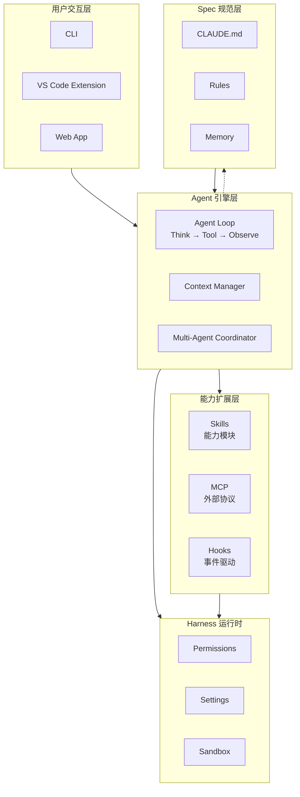
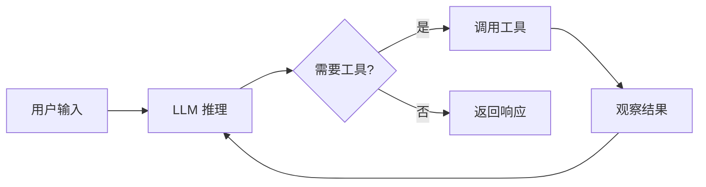
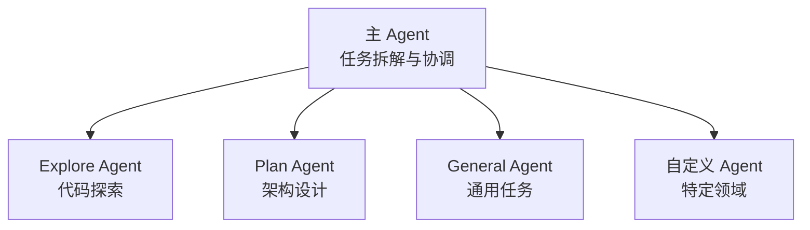
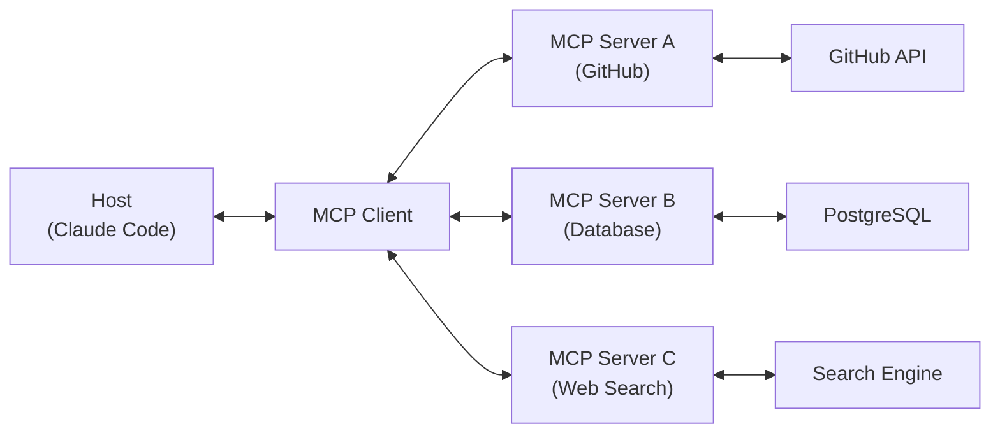
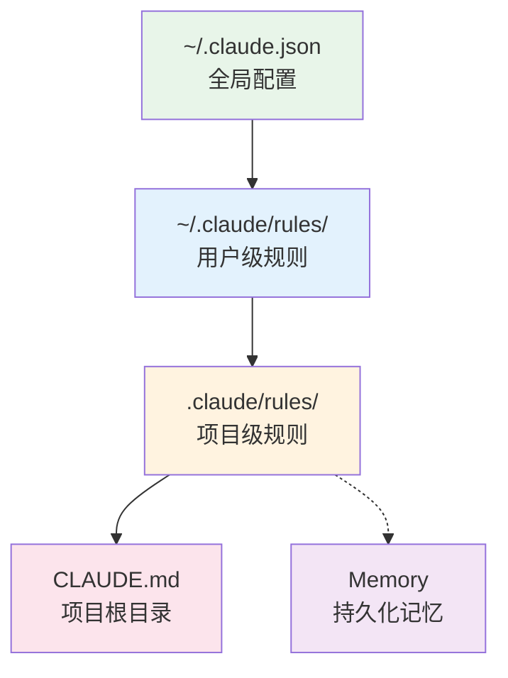

# Claude Code 工具链架构文章 — 实现计划

> **For agentic workers:** REQUIRED SUB-SKILL: Use superpowers:subagent-driven-development (recommended) or superpowers:executing-plans to implement this plan task-by-task. Steps use checkbox (`- [ ]`) syntax for tracking.

**Goal:** 撰写一篇 8000-10000 字的深度技术文章，面向熟悉 Anthropic 生态的开发者，全面解析 Claude Code 工具链架构

**Architecture:** 单文件 Markdown 文章（GitHub 发布），分 9 章，自顶向下从全局架构到各组件深入再到生态包实战

**Tech Stack:** Markdown, Mermaid (架构图), 真实配置代码示例

---

## 文件结构

```
/mnt/d/assistant/engineer-guild/
├── article.md                          # 文章主文件（最终产出）
└── docs/superpowers/
    ├── specs/2026-04-20-...-design.md   # 已完成的设计规格
    └── plans/2026-04-20-...-article.md  # 本计划文件
```

**说明:** 文章输出为单个 `article.md` 文件。每完成一个章节即提交一次，方便回滚和增量审阅。

---

## Task 1: 文章骨架与第 1 章（引言）

**Files:**
- Create: `/mnt/d/assistant/engineer-guild/article.md`

- [ ] **Step 1: 创建文章骨架**

创建 `article.md`，包含标题、目录占位、9 个章节标题（`##` 级别），每个章节下留 `<!-- TODO: Chapter N -->` 标记。同时写入文章元信息注释：

```markdown
<!--
Title: 深入 Claude Code 工具链架构：从 Agent 到生态
Target: GitHub Markdown
Language: 中文为主，技术术语保留英文
Estimated: 8000-10000 words
-->

# 深入 Claude Code 工具链架构：从 Agent 到生态

<!-- TOC will be generated after all chapters are written -->

## 1. 引言 — AI 编程的工程化演进
<!-- TODO: Chapter 1 -->

## 2. 全局架构 — Claude Code 的分层设计
<!-- TODO: Chapter 2 -->

...
```

- [ ] **Step 2: 撰写第 1 章引言（~500 字）**

核心论点：

**第 1 段（范式转变）:** AI 编程工具正在经历从 chat-based 到 agent-based 的根本性转变。Chat-based 工具（ChatGPT、Cursor Chat）本质是「问答」，用户提出问题，AI 返回答案，用户手动执行。Agent-based 工具（Claude Code、Copilot Workspace）本质是「委托」，用户描述目标，AI 自主规划、调用工具、执行多步骤任务。

**第 2 段（架构认知的必要性）:** 在 chat-based 时代，理解工具内部机制是「加分项」。但在 agent-based 时代，这是「必修课」。因为你要配置 AI 的能力边界（Skills）、控制 AI 的行为规范（Spec）、连接 AI 与外部系统（MCP）、设置自动化流水线（Hooks）。不理解的后果是：AI 要么能力不足无法完成任务，要么权限过大造成安全隐患。

**第 3 段（文章路线图）:** 本文将从全局架构切入，自顶向下解析 Claude Code 的每一层设计。你将理解 Agent 如何思考和决策，Skill 系统如何扩展 AI 的能力，MCP 协议如何连接外部世界，Hooks 如何实现事件驱动自动化，Spec 如何用声明式配置塑造 Agent 行为，Harness 如何提供安全运行时，以及 Superpowers 等生态包如何将这些能力组合成完整的工程方法论。

- [ ] **Step 3: 提交第 1 章**

```bash
cd /mnt/d/assistant/engineer-guild
git add article.md
git commit -m "docs: add article skeleton and chapter 1 (introduction)"
```

---

## Task 2: 第 2 章 — 全局架构

**Files:**
- Modify: `/mnt/d/assistant/engineer-guild/article.md`（替换 Chapter 2 占位符）

- [ ] **Step 1: 撰写全局架构章节（~800 字）**

**第 1 段（分层设计总览）:** 引入分层架构的概念。Claude Code 的设计遵循「关注点分离」原则，每一层只负责一件事，层与层之间通过明确的接口交互。这使得每一层可以独立演进、独立替换。

**架构图（Mermaid 格式，GitHub 原生支持）:**



**第 2 段（各层职责表格）:** 用表格列出每一层的核心职责、关键组件、配置入口：

| 层级 | 核心职责 | 关键组件 | 配置入口 |
|------|----------|----------|----------|
| 用户交互层 | 输入/输出 | CLI, VS Code, Web | — |
| Agent 引擎层 | 思考/决策/执行 | Agent Loop, Context | Agent 配置 |
| 能力扩展层 | 扩展 AI 能力 | Skills, MCP, Hooks | `.claude/skills/`, `mcp.json`, `settings.json` |
| Harness 运行时 | 安全/配置/沙箱 | Permissions, Settings | `settings.json` |
| Spec 规范层 | 行为约束 | CLAUDE.md, Rules, Memory | `CLAUDE.md`, `.claude/rules/` |

**第 3 段（设计哲学）:** 提炼三个核心设计原则：
1. **插件化**：每个能力都是可插拔的模块，不是硬编码
2. **可组合**：Skills + MCP + Hooks 可以自由组合，产生 1+1>2 的效果
3. **声明式优于命令式**：用 Spec 描述「应该怎样」而非「怎样做」

- [ ] **Step 2: 提交第 2 章**

```bash
cd /mnt/d/assistant/engineer-guild
git add article.md
git commit -m "docs: add chapter 2 (global architecture)"
```

---

## Task 3: 第 3 章 — Agent 引擎

**Files:**
- Modify: `/mnt/d/assistant/engineer-guild/article.md`

- [ ] **Step 1: 撰写 Agent 引擎章节（~1200 字）**

**3.1 Agent Loop：核心循环**

用流程图展示 Agent Loop：



解释每一轮 turn 的完整流程：
1. **接收输入**：用户消息或上一轮工具结果
2. **LLM 推理**：Claude 分析当前上下文，决定下一步行动
3. **工具调用决策**：如果需要调用工具（Read、Bash、Grep 等），生成工具调用请求
4. **执行工具**：Harness 层执行工具，返回结果
5. **观察结果**：LLM 将工具结果纳入上下文，继续推理
6. **终止条件**：任务完成 / 达到 token 限制 / 用户中断

**3.2 上下文管理**

System Prompt 的构成（展示实际构成逻辑）：

```
System Prompt = 基础指令
              + Skills（匹配到的 Skill 内容）
              + Rules（.claude/rules/ 下的规则）
              + CLAUDE.md（项目规范）
              + Memory（持久化记忆）
              + MCP Tools 描述（可用工具列表）
```

关键机制：
- **消息压缩 Compaction**：当对话接近 Context Window 上限时，自动压缩历史消息
- **滑动窗口**：保留最近 N 轮完整消息，更早的只保留摘要

**3.3 多 Agent 协作**

解释主 Agent 与子 Agent 的关系：



Agent 类型系统（基于实际的 subagent_type）：
- **Explore**：只读，快速搜索和文件读取
- **Plan**：只读，架构设计和方案规划
- **general-purpose**：全功能，可编辑文件、执行命令
- **frontend-wechat-game-dev**：自定义专用 Agent

并行调度：通过 `Agent` 工具一次派发多个独立子 Agent，各自完成后主 Agent 汇总结果。

- [ ] **Step 2: 提交第 3 章**

```bash
cd /mnt/d/assistant/engineer-guild
git add article.md
git commit -m "docs: add chapter 3 (agent engine)"
```

---

## Task 4: 第 4 章 — Skill 系统

**Files:**
- Modify: `/mnt/d/assistant/engineer-guild/article.md`

- [ ] **Step 1: 撰写 Skill 系统章节（~1200 字）**

**4.1 Skill 是什么**

核心定义：Skill 是一段用 Markdown 编写的**结构化指令**，它教 Agent 「如何完成某类任务」。与传统的代码插件不同，Skill 不是可执行代码，而是给 LLM 的行为指导。

关键区分：

| 特性 | 传统插件 | Skill |
|------|----------|-------|
| 本质 | 可执行代码 | 结构化文本指令 |
| 执行者 | 运行时引擎 | LLM 自身 |
| 扩展方式 | 添加函数/模块 | 教会 AI 新的方法论 |
| 失败模式 | 抛异常 | AI 可能忽略指令 |
| 调试方式 | 断点/日志 | 检查 AI 是否遵循指令 |

**4.2 Skill 的文件结构**

展示真实的 Skill 文件格式（基于 superpowers 的实际结构）：

```markdown
---
name: brainstorming
description: "You MUST use this before any creative work - creating features,
  building components, adding functionality, or modifying behavior."
---

# Brainstorming Ideas Into Designs

Help turn ideas into fully formed designs and specs through
natural collaborative dialogue.

## Checklist

You MUST create a task for each of these items:

1. **Explore project context** — check files, docs, recent commits
2. **Ask clarifying questions** — one at a time
3. **Propose 2-3 approaches** — with trade-offs
4. **Present design** — get user approval
...
```

解释 frontmatter 字段：
- `name`：Skill 标识符，用于 `/skill-name` 斜杠命令调用
- `description`：触发描述，Agent 根据此描述决定何时使用该 Skill

解释 body 中的特殊指令：
- `<HARD-GATE>`：强制门控，必须满足条件才能继续
- `<SUBAGENT-STOP>`：子 Agent 跳过此 Skill
- `<EXTREMELY-IMPORTANT>`：关键行为规则

**4.3 Skill 的发现与加载**

三种 Skill 来源：
1. **内置 Skill**：Claude Code 自带（如 `/init`、`/review`）
2. **项目 Skill**：位于项目目录 `.claude/skills/`
3. **插件 Skill**：通过安装插件获得（如 Superpowers 的 13 个 Skill）

加载流程：
```
对话启动 → 扫描所有 Skill 的 description →
  匹配到相关 Skill → 加载完整内容到 System Prompt
```

**4.4 自定义 Skill 实战**

给出一个完整的自定义 Skill 示例：

```markdown
---
name: api-design
description: "Use when designing REST API endpoints - ensures consistent
  naming, error handling, and documentation patterns."
---

# API Design Skill

## Rules

1. Use plural nouns for resource names (`/users`, not /user`)
2. Return consistent envelope: `{ success, data, error, meta }`
3. Validate all inputs with JSON Schema
4. Document with OpenAPI 3.0 spec

## Checklist

- [ ] Resource names follow plural convention
- [ ] Response envelope is consistent
- [ ] Input validation is defined
- [ ] Error codes follow HTTP standard
- [ ] OpenAPI spec is generated
```

- [ ] **Step 2: 提交第 4 章**

```bash
cd /mnt/d/assistant/engineer-guild
git add article.md
git commit -m "docs: add chapter 4 (skill system)"
```

---

## Task 5: 第 5 章 — MCP 协议

**Files:**
- Modify: `/mnt/d/assistant/engineer-guild/article.md`

- [ ] **Step 1: 撰写 MCP 协议章节（~1200 字）**

**5.1 MCP 是什么**

Model Context Protocol 是一个开放协议，定义了 AI 应用与外部工具/数据源之间的标准化通信方式。类比：USB 协议统一了外设连接，MCP 统一了 AI 与外部世界的连接。

解决的核心问题：没有 MCP 时，每个 AI 应用需要为每个外部服务写专门的集成代码。有了 MCP，任何 MCP Server 都可以被任何支持 MCP 的 AI 应用直接使用。

**5.2 MCP 架构**



三个角色：
- **Host**：运行 AI 的应用程序（Claude Code）
- **Client**：协议客户端，在 Host 内部管理 Server 连接
- **Server**：提供工具和数据的外部服务

**5.3 MCP 三大原语**

| 原语 | 类比 | 说明 | 示例 |
|------|------|------|------|
| Tools | 函数调用 | AI 可调用的操作 | `search_code`, `create_issue` |
| Resources | 文件/数据 | AI 可读取的数据源 | 代码仓库、数据库 schema |
| Prompts | 模板 | 预定义的提示模板 | 代码审查模板、commit 模板 |

**5.4 MCP 配置实战**

展示真实的 MCP 配置（基于 `~/.claude/mcp.json` 的实际格式）：

```json
{
  "mcpServers": {
    "github": {
      "command": "npx",
      "args": ["-y", "@modelcontextprotocol/server-github"],
      "env": {
        "GITHUB_PERSONAL_ACCESS_TOKEN": "ghp_your_token"
      }
    },
    "filesystem": {
      "command": "npx",
      "args": ["-y", "@modelcontextprotocol/server-filesystem", "/path/to/allowed/dir"]
    }
  }
}
```

关键配置字段：
- `command`：启动 MCP Server 的命令
- `args`：命令参数
- `env`：环境变量（API Key 等敏感信息）
- 传输方式：stdio（本地进程通信）vs SSE（远程 HTTP）

**5.5 设计权衡**

MCP vs 直接 API 调用：
- **MCP 优势**：标准化、可复用、权限隔离、工具描述自动发现
- **MCP 劣势**：额外进程开销、协议层抽象成本
- **何时用 MCP**：需要让 AI 访问外部服务时，总是优先用 MCP
- **何时不用**：简单的本地操作（Claude Code 内置工具已足够）

- [ ] **Step 2: 提交第 5 章**

```bash
cd /mnt/d/assistant/engineer-guild
git add article.md
git commit -m "docs: add chapter 5 (MCP protocol)"
```

---

## Task 6: 第 6 章 — Hooks 机制

**Files:**
- Modify: `/mnt/d/assistant/engineer-guild/article.md`

- [ ] **Step 1: 撰写 Hooks 章节内容（~1000 字）**

**6.1 Hooks 是什么**

Hooks 是事件驱动的 shell 命令，在 Agent 工具调用的特定阶段自动触发。它们不改变 Agent 的推理过程，而是在执行层面插入自定义逻辑。

三种事件类型：

| 事件 | 触发时机 | 典型用途 |
|------|----------|----------|
| `PreToolUse` | 工具执行前 | 安全检查、参数验证、权限控制 |
| `PostToolUse` | 工具执行后 | 自动格式化、日志记录、审计 |
| `SessionStart` | 对话启动时 | 加载环境、注入上下文 |

与 CI/CD hook 的对比：CI/CD hook 作用于构建流水线，Claude Code Hooks 作用于 AI 的每一次工具调用。

**6.2 Hooks 配置**

展示真实的 Hooks 配置格式（基于 superpowers 的 hooks.json）：

```json
{
  "hooks": {
    "SessionStart": [
      {
        "matcher": "startup|clear|compact",
        "hooks": [
          {
            "type": "command",
            "command": "path/to/script.sh",
            "async": false
          }
        ]
      }
    ],
    "PreToolUse": [
      {
        "matcher": "Bash",
        "hooks": [
          {
            "type": "command",
            "command": "security-audit.sh $TOOL_INPUT",
            "async": false
          }
        ]
      }
    ]
  }
}
```

配置字段解析：
- `matcher`：匹配工具名（支持正则），决定哪些工具触发此 hook
- `type`：固定为 `command`
- `command`：执行的 shell 命令，支持环境变量替换
- `async`：是否异步执行

**6.3 实战场景**

场景 1 — 自动代码格式化：
```json
{
  "hooks": {
    "PostToolUse": [
      {
        "matcher": "Edit|Write",
        "hooks": [{
          "type": "command",
          "command": "npx prettier --write $FILE_PATH",
          "async": true
        }]
      }
    ]
  }
}
```

场景 2 — 安全审计：
```json
{
  "hooks": {
    "PreToolUse": [
      {
        "matcher": "Bash",
        "hooks": [{
          "type": "command",
          "command": "audit-log.sh \"$(date) $TOOL_INPUT\"",
          "async": false
        }]
      }
    ]
  }
}
```

**6.4 Hooks vs MCP Tools**

| 维度 | Hooks | MCP Tools |
|------|-------|-----------|
| 定位 | 拦截器，在已有工具调用前后插入逻辑 | 新工具，扩展 AI 可用的操作 |
| 执行者 | Harness 层（shell） | MCP Server（独立进程） |
| AI 感知 | AI 不知道 Hooks 的存在 | AI 主动选择调用 MCP Tool |
| 适用场景 | 审计、格式化、安全检查 | 调用外部 API、访问数据库 |

- [ ] **Step 2: 提交第 6 章**

```bash
cd /mnt/d/assistant/engineer-guild
git add article.md
git commit -m "docs: add chapter 6 (hooks mechanism)"
```

---

## Task 7: 第 7 章 — Spec 规范

**Files:**
- Modify: `/mnt/d/assistant/engineer-guild/article.md`

- [ ] **Step 1: 撰写 Spec 规范章节内容（~800 字）**

**7.1 Spec 是什么**

Spec 是声明式的规范文件，告诉 Agent 应该遵循什么规则和约束。如果 Skill 是教 Agent 「怎么做」，Spec 就是告诉 Agent 「必须遵守什么」。

类比：Skill 像 SOP（标准操作流程），Spec 像法规（不可违反的约束）。

**7.2 Spec 的层次结构**



优先级（从高到低）：
1. **CLAUDE.md**（项目根目录）：项目级规范，随项目版本控制
2. **Rules**（`.claude/rules/`）：分类规则文件，按场景组织
3. **Memory**（持久化记忆）：用户偏好、项目上下文
4. **用户级 Rules**（`~/.claude/rules/`）：跨项目的个人偏好

**7.3 CLAUDE.md 示例**

```markdown
# My Project

## Build Commands
- Build: `npm run build`
- Test: `npm test`
- Lint: `npm run lint`

## Code Style
- Use TypeScript strict mode
- Prefer const over let
- No mutation, use immutable patterns

## Architecture
- Follow feature-based organization
- Each feature has its own directory with components, hooks, types
- Shared utilities in src/lib/
```

**7.4 Spec 与 Agent 的关系**

注入机制：
1. 对话启动时，Harness 扫描所有 Spec 文件
2. 将 CLAUDE.md + Rules + Memory 注入 System Prompt
3. Agent 在推理时自动遵循这些约束

热更新：修改 Spec 文件后即时生效，无需重启。Agent 在下一轮推理时自动读取新的规则。

- [ ] **Step 2: 提交第 7 章**

```bash
cd /mnt/d/assistant/engineer-guild
git add article.md
git commit -m "docs: add chapter 7 (spec and rules)"
```

---

## Task 8: 第 8 章 — Harness 运行时

**Files:**
- Modify: `/mnt/d/assistant/engineer-guild/article.md`

- [ ] **Step 1: 撰写 Harness 章节内容（~800 字）**

**8.1 Harness 是什么**

Harness 是 Claude Code 的运行时基础设施层。如果说 Agent 是「大脑」，那 Harness 就是「身体」—— 它负责权限管理、配置加载、沙箱执行、工具注册等所有底层能力。

Harness 的核心职责：
- **权限管理**：控制 Agent 可以使用哪些工具、执行哪些命令
- **配置加载**：合并多层级的 settings 配置
- **工具注册**：将内置工具 + MCP Tools 暴露给 Agent
- **沙箱执行**：隔离 Agent 的 Bash 执行环境

**8.2 权限模型**

三级权限：`allow`（自动允许）/ `deny`（拒绝）/ `ask`（每次询问）

配置示例：

```json
{
  "permissions": {
    "allow": [
      "Bash(git status)",
      "Bash(npm test)",
      "Read",
      "Grep"
    ],
    "deny": [
      "Bash(rm -rf *)"
    ]
  }
}
```

权限匹配使用 pattern：
- `Bash(git status)` — 精确匹配命令
- `Bash(npm *)` — 匹配所有 npm 开头的命令
- `Read` — 匹配整个工具类别

**8.3 配置层级**

```
全局 ~/.claude.json
  ↓ merge
用户 ~/.claude/settings.json
  ↓ merge
项目 .claude/settings.json
  ↓ merge
本地 .claude/settings.local.json（不入 git）
```

合并策略：deep merge，后加载的覆盖先加载的。`settings.local.json` 用于存放敏感信息（API Key 等），应加入 `.gitignore`。

**8.4 沙箱机制**

Bash 命令的执行隔离：
- 在受限 shell 环境中执行
- 危险命令需要用户确认（`rm -rf`、`git push --force` 等）
- 文件系统访问受项目目录限制
- 网络请求需要通过 MCP Server，不能直接 curl

- [ ] **Step 2: 提交第 8 章**

```bash
cd /mnt/d/assistant/engineer-guild
git add article.md
git commit -m "docs: add chapter 8 (harness runtime)"
```

---

## Task 9: 第 9 章 — 生态包实战

**Files:**
- Modify: `/mnt/d/assistant/engineer-guild/article.md`

- [ ] **Step 1: 撰写生态包章节内容（~1500 字）**

**9.1 生态包概述**

Claude Code 的插件/包是一个包含 Skills + Rules + Hooks 的可分发包。它通过组合三种扩展机制，为 Agent 注入完整的工程方法论。

安装方式：
```bash
# 通过 CLI 安装
claude plugin add superpowers

# 安装后，Skills、Rules、Hooks 自动生效
```

包的目录结构（以 Superpowers 为例）：

```
superpowers/
├── .claude-plugin/
│   └── plugin.json        # 包元数据
├── skills/                 # Skill 文件
│   ├── brainstorming/
│   ├── test-driven-development/
│   ├── writing-plans/
│   ├── executing-plans/
│   └── ...
├── hooks/
│   └── hooks.json          # Hook 配置
├── CLAUDE.md               # 包级 Spec
└── package.json
```

**9.2 Superpowers 深度解析**

Superpowers 的设计理念：**为 Claude Code 注入软件工程方法论**。它不是增加功能，而是确保 AI 遵循经过验证的开发流程。

核心 Skill 链解析：

**brainstorming → writing-plans → executing-plans：** 这是 Superpowers 的主线流程。

```
brainstorming（理解需求）
  ↓ 产出 Spec 文件
writing-plans（制定计划）
  ↓ 产出 Plan 文件
executing-plans（执行计划）
  ↓ 产出 代码 + 测试
requesting-code-review（审查代码）
```

每个 Skill 的职责：
- **brainstorming**：强制 AI 在动手前先理解需求，通过 Checklist 确保不遗漏
- **test-driven-development**：红-绿-重构循环，先写测试再写实现
- **writing-plans**：将 Spec 转化为可执行的任务列表
- **executing-plans**：按任务列表逐步执行，每步有验证检查点
- **systematic-debugging**：遇到 bug 时系统化排查，不是随机试错
- **requesting-code-review**：完成后自动发起代码审查
- **receiving-code-review**：收到审查反馈后系统化处理

Superpowers 如何组合 Skills + Hooks + Rules：
- **Hooks**：SessionStart 时自动注入 using-superpowers Skill 到上下文
- **Skills**：13 个方法论 Skill，按需加载
- **Rules**：CLAUDE.md 中定义包级行为规范

**9.3 其他热门包概览**

| 包名 | 定位 | 核心能力 |
|------|------|----------|
| `init` | 项目初始化 | 自动生成 CLAUDE.md |
| `simplify` | 代码简化 | 审查代码的复用性和效率 |
| `security-review` | 安全审查 | OWASP Top 10 检查 |
| `loop` | 循环任务 | 定时重复执行命令 |
| `schedule` | 定时调度 | Cron 式远程 Agent 调度 |
| `claude-hud` | 状态栏 | 实时显示 Agent 状态 |

**9.4 选型建议**

按团队规模选择：
- **个人开发者**：Superpowers + init 即可
- **小团队（2-5 人）**：加 security-review + simplify
- **大团队（5+ 人）**：全套 + 自定义 Skill + 自定义 Rules

按项目类型选择：
- **Web 前端**：加前端专用 Skill
- **后端 API**：加 API 设计 Skill
- **游戏开发**：加游戏专用 Skill（如 WeChat Mini Game）

- [ ] **Step 2: 提交第 9 章**

```bash
cd /mnt/d/assistant/engineer-guild
git add article.md
git commit -m "docs: add chapter 9 (ecosystem packages)"
```

---

## Task 10: 总结与收尾

**Files:**
- Modify: `/mnt/d/assistant/engineer-guild/article.md`

- [ ] **Step 1: 撰写总结段落（~300 字）**

**总结段落要点：**

回顾全局架构的各层协作关系。强调 Claude Code 的设计哲学不是「一个强大的 AI」，而是「一个可配置的 AI 系统」。理解 Agent、Skill、MCP、Hooks、Spec、Harness 各自的职责和协作方式，是从「AI 用户」到「AI 架构师」的关键一步。

给出下一步行动建议：
1. 从一个自定义 Skill 开始，体验声明式 AI 编程
2. 配置 MCP Server 连接你常用的外部服务
3. 为团队项目写一份 CLAUDE.md
4. 安装 Superpowers，体验系统化的开发流程

- [ ] **Step 2: 生成目录**

在文章开头添加手动目录或标记，GitHub 会自动生成锚点。

- [ ] **Step 3: 全文审阅**

通读全文检查：
- 章节之间的过渡是否自然
- 术语使用是否一致（首次中英并列，后续纯英文）
- 代码示例是否准确
- 架构图是否与文字描述一致
- 总字数是否在 8000-10000 字范围内

- [ ] **Step 4: 最终提交**

```bash
cd /mnt/d/assistant/engineer-guild
git add article.md
git commit -m "docs: complete article - Claude Code toolchain architecture deep dive"
```

---

## 自检清单

- [x] Spec 覆盖：每章对应 spec 中的章节设计
- [x] 无 placeholder：所有步骤包含实际内容指引
- [x] 类型一致：术语使用全文统一
- [x] 文件路径明确：所有操作指向 `/mnt/d/assistant/engineer-guild/article.md`
